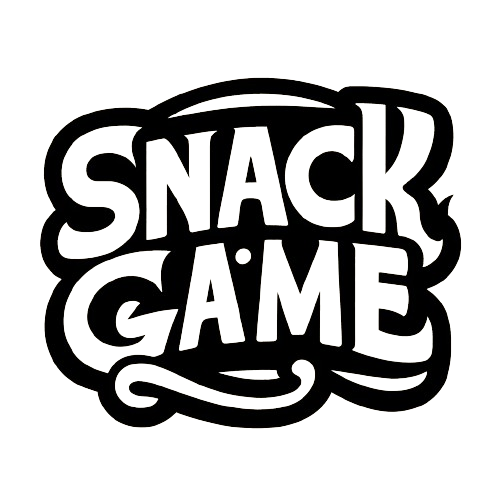
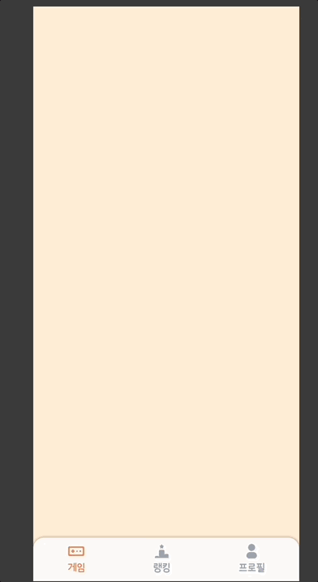
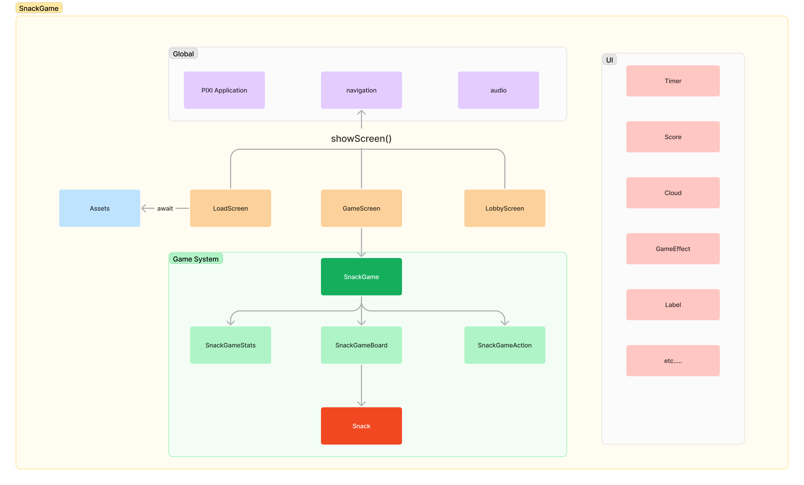

    

# 🍿 Snack Game!!

    

> **스낵을 선택해 숫자합 10을 만들어 제거해 보아요!**
>
> **스낵은 상, 하, 좌, 우, 대각선 방향으로 선택이 가능해요.**
> 
> **황금 스낵을 제거해서 판을 새로고침하고 고득점을 노려보아요!**

# Snack Game은 이런 도구를 사용했어요.
## Language
* `Typescript`
## Library
* `React`
* `Emotion`
* `Recoil`
* `React Query`
* `Hot Toast`
* `GSAP`
* `chart.js`
## For Game
* `Pixi.js`
* `@pixi/sound`
* `@pixi/assets`
* `@pixi/ui`
## ETC.
* `Sentry`
* `Hotjar`
* `vercel`

# Snack Game 아키텍처

    

> Snack Game 제작에 많은 도움을 받은 pixi open-games 레포입니다.
>  https://github.com/pixijs/open-games
